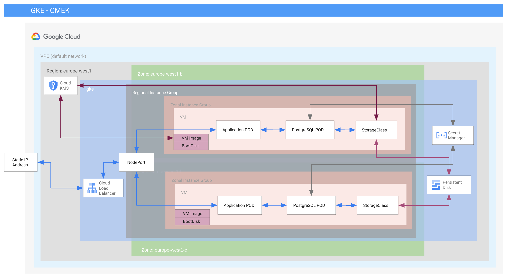

Source: https://cloud.google.com/architecture/deploying-highly-available-postgresql-with-gke
Source: https://testdriven.io/blog/running-flask-on-kubernetes/

0. task-cluster-sa@cmek-gke-demo.iam.gserviceaccount.com
gcloud container clusters get-credentials task-cluster --region europe-west1
gcloud components install kubectl
echo "mega_secret_key" | base64
echo "jeremy" | base64
kubectl apply -f k8s/postgres-secrets.yaml 
kubectl apply -f k8s/postgres-pv.yaml 
kubectl apply -f k8s/postgres-deployment.yaml 
kubectl apply -f k8s/postgres-service.yaml
gcloud builds submit --config=cloudbuild.yaml


POD=`kubectl get pods -l service=postgres -o wide | grep -v NAME | awk '{print $1}'`
kubectl exec -it $POD -- psql -U jeremy

```
create database flaskapi;
\c flaskapi;
select * from users;
\q

```

kubectl apply -f k8s/flaskapp-service.yaml 
kubectl apply -f k8s/flaskapp-deployment.yaml 
kubectl apply -f k8s/flaskapp-network.yaml 

curl -H "Content-Type: application/json" -d '{"name": "Jeremy Toussaint", "email": "jt151077@gmail.com", "pwd": "qwert"}' http://34.79.166.251:5000/create

